<h3><code>roshan@github ~ $ whoami</code></h3>

<table>
  <tr>
    <td valign="top"></td>
    <td valign="top"></td>
  </tr>
</table>

 

<h3><code>roshan@github ~ $ ls -la ./shipped</code></h3>

| | | |
|---|---|---|
| **[DashNav](https://apps.apple.com/np/app/dashnav-for-ktm-gen3-tft/id6791850024)** | Flutter + Swift · iOS | Turn-by-turn navigation mirrored onto a KTM motorcycle's Gen3 TFT dashboard. Reverse-engineered the KTM BCCU BLE protocol — handshake, AES-128-CBC, SHA-512 key derivation — reimplemented in Swift and verified byte-for-byte on real hardware. |
| **[flutter_virtual_tryon](https://pub.dev/packages/flutter_virtual_tryon)** | Dart package · MIT | Cross-platform face tracking and overlay engine. ML Kit on mobile, MediaPipe on web, one frozen API. Seven releases, 145 tests. |
| **[Kalo Chasma](https://play.google.com/store/apps/details?id=com.eachut.kalochasma)** | Flutter · 4 platforms | Multi-vendor eyewear marketplace. 25 feature modules, Firebase backend with 20+ Cloud Functions, six-role RBAC, eSewa + Stripe with signature-verified webhooks. |
| **[PDF Tool](https://apps.apple.com/np/app/pdf-tool/id6760588069)** | Flutter · 4 platforms | 20+ PDF utilities — merge, split, OCR, redact, sign — all on-device. No backend, no signup, no analytics. |
| **[NOC Prices](https://apps.apple.com/us/app/noc-prices/id6444857714)** | Flutter · iOS, Android | Nepal fuel price tracker with trend history, push alerts and offline cache. |
| **[Hariyo Naksha](https://apps.apple.com/us/app/hariyo-naksha/id6744655279)** | Flutter · iOS, Android | Travel tracker across Nepal's 77 districts. Custom SVG rendering with `CustomPaint` and hit testing — no map SDK. |
| **[Cylin](https://play.google.com/store/apps/details?id=com.eachut.cylin)** | Flutter · iOS, Android | Gas cylinder ordering and delivery, customer and operator roles, OTP auth, Maps, payments. |
| **[Nepal SMS](https://apps.apple.com/us/app/nepal-sms/id6445808984)** | Flutter · iOS, Android | SMS over internet to Nepali numbers. In-app purchase credits, Google/Apple Sign-In, emergency SMS with location. |

 

<h3><code>roshan@github ~ $ cat ./contact</code></h3>

 

<code>Kathmandu, Nepal · UTC+5:45 · open to remote</code>

